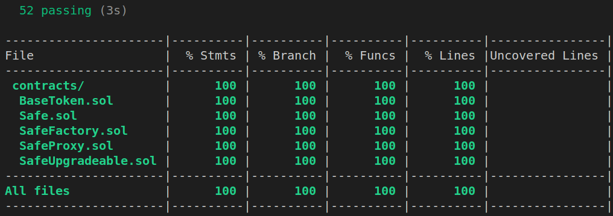
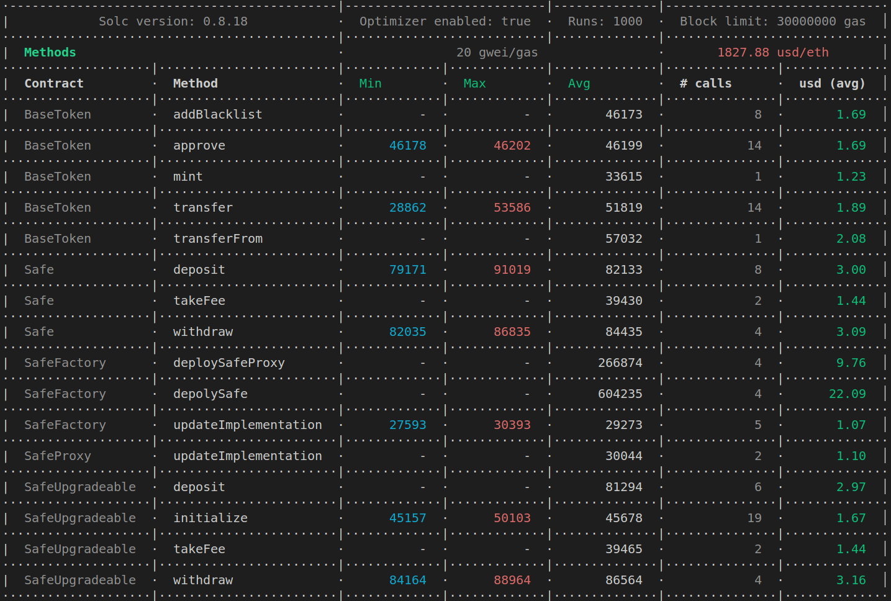
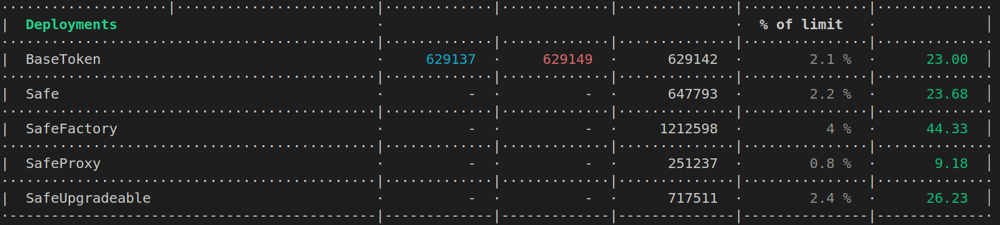

# 311551044-bdaf-lab4

[](https://codecov.io/gh/alan890104/311551044-bdaf-lab4)

## Requirements

For this homework, you need to write four contracts: **A**, **B**, **C**, and **D**:

- Contract **A**: Add a TakeFee function to the **Lab3 assignment** and ensure it has an owner.
- Contract **B**: Similar to **A**, but an implementation contract that can be initialized by the initialization function by the owner. Initialization is necessary since the constructor doesn't get executed when being pointed by proxies.
- Contract **C**: A proxy contract with an owner that only needs to have two unstructured storages - owner and implementation. Only the owner can update the implementation contract, which is currently contract **B**.
- Contract **D**: A factory contract with an owner that stores the current implementation address. It has three functions: **F1**, **F2**, **F3**:
  - **F1**: deploySafe. This function can deploy contract **A**.
  - **F2**: deploySafeProxy. This function can deploy contract **C**. The caller of **F2** and implementation address should be passed as an argument to the constructor of **C**. We should call initialization to initialize **B** after **C** being deployed.
  - **F3**: updateImplementation. This function updates the current implementation address in **D** only, and only the owner of **D** can call this function.

## Coverage Report

I have enabled [github action](https://github.com/alan890104/311551044-bdaf-lab4/actions) to automatically deploy a [github page](https://alan890104.github.io/311551044-bdaf-lab4/) to show the coverage report.

（ @Martinet, @Ryan 用[這個連結](https://alan890104.github.io/311551044-bdaf-lab4/)看吧，對眼睛比較好XD）

### Local Report



### Coverage report graph by codecov


## Gas Report

- methods
    
- deployments
    

## Install dependencies

```shell
npm install
```

## Compile

```shell
npx hardhat compile
```

## Test with gas report

```shell
REPORT_GAS=true npx hardhat test
```

## Test with coverage report

```shell
npx hardhat coverage
```

## Deploy

```shell
npx hardhat run scripts/deploy.ts
```
